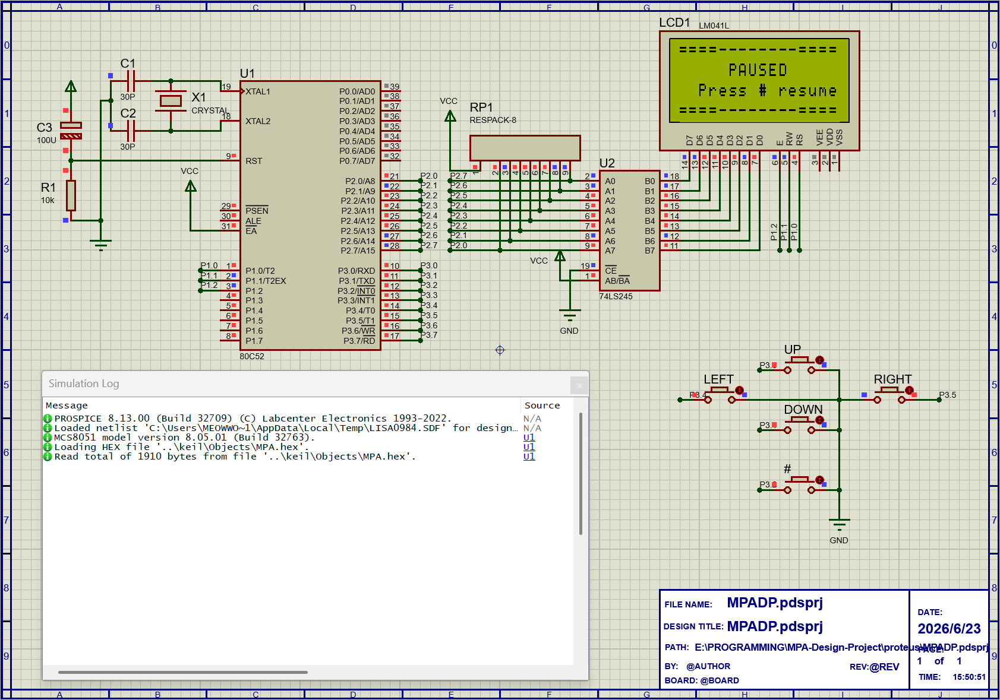

## Microcontroller Principles and Applications Design Project

### Features

- Standard lib unused
- Random spawn enemy
- Seed personality
- Pause available game
- 80C51 / 80C52

Program Size: data=48.5 xdata=0 code=1918

### Used chips

| Name          | Usage        |
|---------------|--------------|
| 80C51 / 80C52 | Main CPU     |
| 74LS245       | Driver       |
| LM041L        | 4*16 Display |

### Gallery

